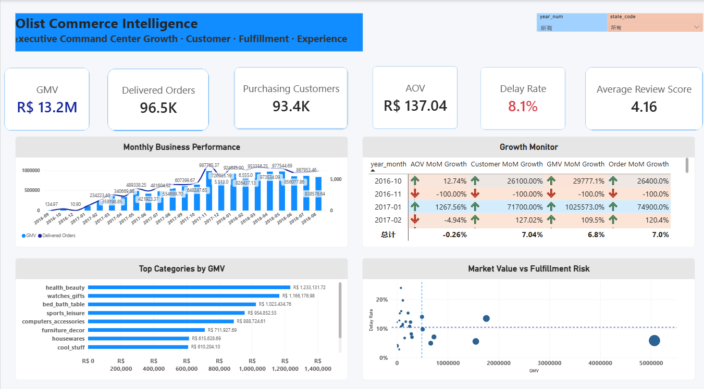
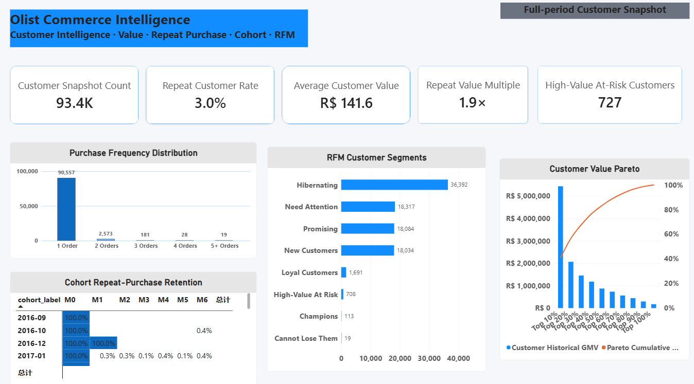
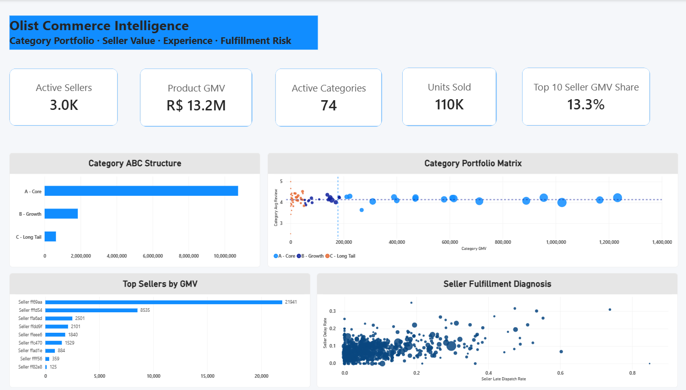
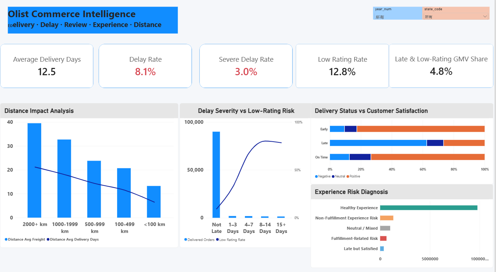

# Olist Commerce Intelligence 360
### 电商经营分析与履约体验诊断 | E-commerce Analytics Portfolio

**MySQL 8 · Python · Power BI · 业务分析 · 统计验证**

基于 Olist 巴西电商公开交易数据，从 **经营增长 → 客户价值 → 商品与卖家 → 履约体验** 四个层面建立电商经营分析体系。项目覆盖多表数据质量核查、订单粒度语义层、经营指标与客户分层、Power BI 可视化，以及配送延迟与低评分之间的统计关联分析。

> **项目定位**：数据分析求职作品集。重点展示如何从业务问题出发，保证指标口径正确，并用统计方法支撑有边界的业务判断。

**快速导航**　[Dashboard 展示](#-dashboard-四页经营分析) · [核心发现](#-关键业务发现) · [SQL 分析](sql/README.md) · [Python 统计分析](python/01_delivery_review_analysis.ipynb) · [指标口径](docs/metric_definitions.md)

---

## 项目概览 | Overview

| 分析对象 | 数据与方法 |
| --- | --- |
| 数据来源 | [Olist Brazilian E-Commerce Public Dataset](https://www.kaggle.com/datasets/olistbr/brazilian-ecommerce)（9 张原始 CSV 表） |
| 数据处理 | MySQL 多表关联、粒度控制、质量核验、语义层与报表视图 |
| 业务分析 | 增长分析、复购与 Cohort、RFM、品类 ABC、卖家绩效、地理与履约 |
| 可视化交付 | 四页 Power BI Dashboard 截图 |
| 统计验证 | 卡方检验、Risk Difference / Risk Ratio、Logistic 回归与敏感性分析 |

**业务口径**：商品 GMV 统计已交付订单的商品金额，**不含运费**；客户以 `customer_unique_id` 识别；评分来自订单而非商品明细。这些定义贯穿 SQL、Dashboard 与 Python 分析。

## 📊 Dashboard：四页经营分析

四页按照“整体经营 → 客户 → 商品与卖家 → 履约与体验”的阅读顺序组织；下方均为项目实际导出的页面截图。

### 01 · Executive Overview｜经营总览

**业务问题：** 平台经营规模如何变化？哪些品类与地区值得进一步关注？

展示 GMV、已交付订单、购买客户、AOV、月度表现，以及品类贡献和区域价值与履约风险。



### 02 · Customer Intelligence｜客户价值与复购

**业务问题：** 谁在复购？客户价值集中在什么人群？哪些群体需要差异化运营？

展示购买频次、客户历史价值集中度、Cohort 月度重复购买和 RFM 分群。RFM 为**观察期快照**，不是任意历史时点的动态分群。



### 03 · Product & Seller Intelligence｜商品组合与卖家运营

**业务问题：** 哪些品类与卖家贡献核心商品 GMV？高价值卖家是否伴随履约问题？

展示品类 ABC、品类价值与评分、卖家贡献，以及卖家晚发货与最终配送延迟之间的对比。订单最终延迟**不能直接归责于卖家**。



### 04 · Fulfillment & Customer Experience｜履约与客户体验

**业务问题：** 配送延迟与低评分的关系有多强？不同严重程度及运输距离下的表现有何差异？

展示延迟程度、评分结构、体验风险分组及距离与物流成本的关系。其中距离采用**单卖家订单的直线距离近似值**。



[查看四页 Dashboard 的分析逻辑 →](dashboard/README.md)

---

## 🔎 关键业务发现

### 发现 01｜复购客户比例不高，但历史客户价值存在明显差异

在已展示的全观察期客户分析中，复购率约为 **3.0%**，复购客户的人均历史商品消费金额约为一次性购买客户的 **1.9 倍**。

**业务启发**：可以进一步关注首购到二购的转化及分层维护，但不能把两类客户的历史差异直接当作营销活动的增量效果。不同客户的观察时间也可能不同。

### 发现 02｜配送延迟与低评分存在显著统计关联

基于**原始二分类延迟标记**、有有效评分且履约状态可判断的订单：

| 订单组别 | 订单数 | 低评分订单数 | 低评分率 |
| --- | ---: | ---: | ---: |
| 未延迟 | 88,163 | 8,130 | **9.22%** |
| 延迟 | 7,661 | 4,142 | **54.07%** |

- **风险差**：44.84 个百分点（95% CI：43.71–45.97）。
- **风险比 RR**：5.863（95% CI：5.694–6.037）。
- 卡方检验支持两组评分比例存在统计关联（p < 0.001）。

**业务启发**：优先调查严重延迟、低评分及高 GMV 同时集中的业务群体。这里的统计关系是**关联，不是因果证明**；原始延迟标记与按整天分组的延迟严重程度也可能在不足一天的边界上不同。

### 发现 03｜严重程度分析能进一步定位体验风险

在延迟天数分组分析中，低评分率随延迟加重而明显提高，但最高的两个延迟组之间**并非严格单调递增**。因此，报告严重程度结果时还应同时展示样本量、95% 置信区间和调整后 OR。

| 延迟程度与低评分率 | 调整后 Logistic OR |
| --- | --- |
|  |  |

**统计解释**：OR 是 *odds ratio（优势比）*，不等于低评分概率比，也不能单独支持因果解释。

[业务发现及局限说明 →](docs/key_findings.md)

---

## 🧩 技术实现与分析逻辑

```text
Olist 原始交易表
        │
        ▼
MySQL：数据画像与质量审计
        │
        ▼
语义层：订单 / 订单商品 / 客户 / 卖家分粒度计算
        │
        ├──► SQL 经营诊断 ──► 报表视图 ──► Power BI 四页展示
        │
        └──► 订单级数据提取 ──► Python 统计检验与回归
```

**技术重点**

1. **避免重复统计**：订单商品、支付和评分均可能为一对多关系，分别聚合到正确粒度后再关联，避免 GMV 被重复累加。
2. **统一指标口径**：区分商品 GMV、含运费订单金额和实付金额；采用真实客户键分析复购；对无评分订单单独处理。
3. **分层业务诊断**：先看平台规模与结构，再识别重点品类、卖家和地区的价值与风险，而不是堆叠排行榜。
4. **统计验证与边界意识**：对配送延迟与低评分计算效应量、置信区间及回归调整，并说明样本选择和观察性研究的局限。

## 📁 项目目录与代码导航

| 目录 / 文件 | 内容 |
| --- | --- |
| [`sql/`](sql/README.md) | 01–16 章业务分析与报表视图，以及 17 章订单级数据提取 SQL |
| [`python/01_delivery_review_analysis.ipynb`](python/01_delivery_review_analysis.ipynb) | 数据质量检查、低评分率、统计检验、Logistic 回归与延迟严重程度分析 |
| [`dashboard/`](dashboard/README.md) | 四页 Dashboard 的分析逻辑与图片入口 |
| [`images/`](images/) | 四张 Dashboard 展示图及两张统计分析图 |
| [`docs/analysis_framework.md`](docs/analysis_framework.md) | 业务问题与分析框架 |
| [`docs/metric_definitions.md`](docs/metric_definitions.md) | 指标口径与粒度说明 |
| [`docs/key_findings.md`](docs/key_findings.md) | 关键发现、业务启发与解释边界 |
| [`data/README.md`](data/README.md) | 原始数据来源及数据表说明 |

### 阅读与复现

推荐阅读顺序：**四页 Dashboard → 关键发现 → SQL 语义层与诊断 → Python 统计分析**。

- SQL 脚本基于 MySQL 8 及已导入的 Olist 原始表；仓库保留了实际分析查询与视图定义，而非一键部署脚本。
- Python Notebook 使用本地订单级 CSV，具体字段与执行顺序见 [Python 使用说明](python/README.md)。
- GitHub 页面提供**静态分析成果、SQL 和 Notebook**，不需要在线 Power BI 服务也能浏览项目主要内容。

## 数据范围与分析局限

本项目是**历史电商交易数据分析**，并非实时经营监控。公开数据没有完整的商品成本、广告投放、获客成本和实验信息，因此 **GMV ≠ 利润**，统计相关性也**不代表因果效应**。Cohort 会受到观察窗口与右删失影响；订单级评价不宜直接推断每件商品或每位卖家的真实满意度。

**Data source:** [Olist Brazilian E-Commerce Public Dataset (Kaggle)](https://www.kaggle.com/datasets/olistbr/brazilian-ecommerce). 该项目为独立学习与求职作品，不代表 Olist 官方分析报告。
