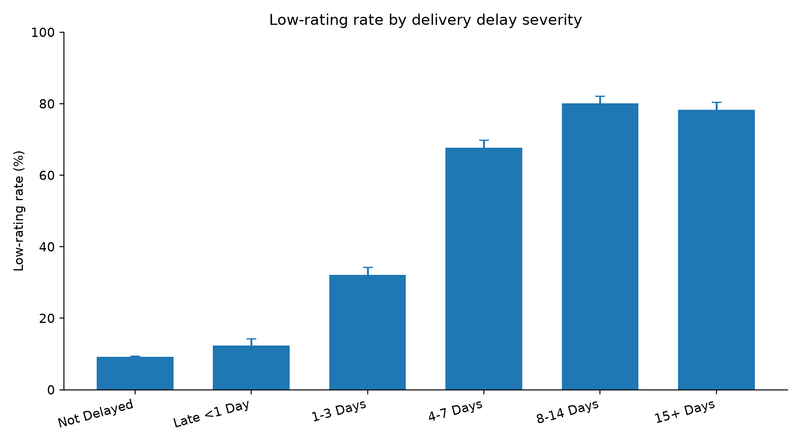
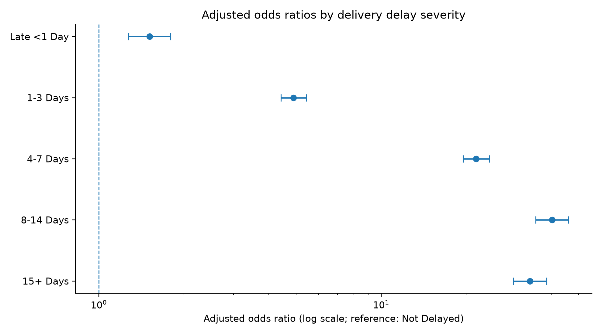

# 核心业务发现与统计解释

本项目以历史订单数据识别业务现象，并通过描述性统计与回归模型检验关联。文中的指标采用对应分析阶段的既定口径；**业务关联不等于因果关系**。

## 一、客户复购：客户数量与历史价值的差异

客户分析面板显示：观察期内复购客户比例约为 **3.0%**，复购客户的人均历史商品消费金额约为一次性购买客户的 **1.9 倍**。

**业务解读：** 全周期复购占比较低，值得进一步分析首购后多久发生第二次购买，以及不同 Cohort 的重复购买情况。但复购客户的历史累计消费金额较高，并不等于实施促复购活动就能获得相同幅度的增量收入；两类客户的可观察购买时间可能不同。

**建议调查：** 关注首购到二购的转化、不同首次购买月份的复购表现，以及高价值但近期未购买的客户群体。

## 二、配送延迟：与客户低评分的关联显著

根据原始二分类延迟标记，在具有有效评分的已交付订单中：

| 订单分组 | 有效评分订单 | 1—2 星订单 | 低评分率 |
| --- | ---: | ---: | ---: |
| 未延迟 | 88,163 | 8,130 | **9.22%** |
| 延迟 | 7,661 | 4,142 | **54.07%** |

主要统计结果：

- **风险差（RD）：44.84 个百分点**，95% 置信区间为 **43.71～45.97 个百分点**。
- **风险比（RR）：5.863**，95% 置信区间为 **5.694～6.037**。
- **Pearson 卡方检验：** χ²(1) ≈ 12,693.82，p < 0.001。

**业务解读：** 延迟组低评分比例明显较高，履约体验值得作为经营诊断的重点。不过，这些指标不表示延迟本身造成同等幅度的评分变化。

**分析口径：** 上述数字以原始 `is_delayed` 标记为依据。按完整天数计算的 `delay_days` 可能将不足一天的延迟记为 0，因此**二分类延迟率与按天数划分的严重程度分组并不完全等价**。

## 三、延迟程度：识别更高风险的订单群体

初步严重程度分析显示，低评分率随延迟天数增加显著升高；但在最高的两个延迟组之间，并未呈现严格单调上升。判断组间差异时应同时考察样本量和置信区间，而不是只比较柱形高度。

| 各延迟组低评分率（含置信区间） | 不同延迟组调整后 OR（森林图） |
| --- | --- |
|  |  |
